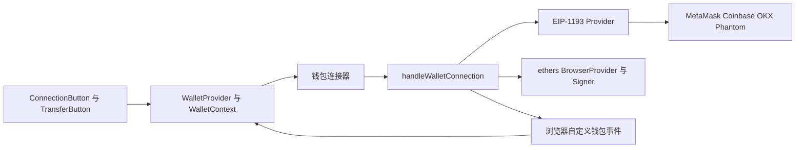
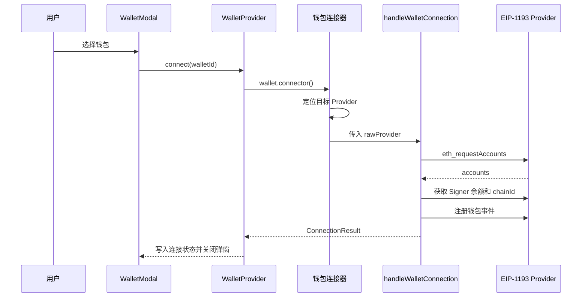

# 自定义 Web3 钱包连接器架构讲解与面试题库

## 1. 这是什么项目

这是一个基于 React、TypeScript、Vite 与 ethers v6 的浏览器端 Web3 钱包连接示例。它以 `WalletProvider` 提供统一的 React 状态与业务方法，并对 MetaMask、Coinbase Wallet、OKX Wallet、Phantom 的 EVM 注入 Provider 做了适配。

项目的重点是“应用如何可靠地使用多个 EIP-1193 钱包”，覆盖以下能力：

- 打开钱包授权并获得账户、网络、Signer 与原生币余额。
- 在多钱包扩展共存时定位用户选择的钱包 Provider。
- 处理 `accountsChanged`、`chainChanged` 与 `disconnect` 生命周期事件。
- 支持切链、原生币转账、交易确认等待与余额刷新。
- 将连接器中的事件转换为 React Context 状态，供 UI 组件使用。

该项目是教学和连接器原型。当前配置只声明 Ethereum Mainnet 与 Sepolia，且链配置中的 Alchemy URL 仍包含 API Key 占位符。

## 2. 技术栈和入口

| 分类 | 实际使用 | 用途 |
| --- | --- | --- |
| UI | React 19 | Context 状态、钱包选择弹窗与转账示例 |
| 语言 | TypeScript | 连接器、状态与配置类型 |
| 构建 | Vite 7 | 本地开发与生产构建 |
| Web3 SDK | ethers 6 | `BrowserProvider`、Signer、交易与回执等待 |
| 钱包协议 | EIP-1193 | 注入 Provider 的 `request` 与事件接口 |
| 样式 | Tailwind CSS 4 | 界面样式 |
| 提示 | react-toastify | 连接、余额与转账结果提示 |

应用入口为 `src/main.tsx`，它将 `App` 挂载到 DOM。`src/App.tsx` 创建一个 `ethers.BrowserProvider(window.ethereum)` 并将链配置、钱包清单和自动连接策略传给 `WalletProvider`。SDK 对外入口 `src/wallet-sdk/index.ts` 仅导出 `WalletProvider` 与 `ConnectionButton`。

## 3. 目录地图

```text
src/
├── App.tsx                         # 示例应用：注入 Provider 和钱包 SDK 配置
├── main.tsx                        # React 挂载入口
└── wallet-sdk/
    ├── index.ts                    # SDK 公开导出
    ├── types.ts                    # Chain、WalletState、WalletContextValue 等契约
    ├── window.d.ts                 # 浏览器钱包注入对象声明
    ├── const/
    │   ├── wallets.ts              # 钱包元数据与显示顺序
    │   ├── chain.ts                # 支持的链和钱包添加链参数
    │   ├── connection.ts           # 连接超时配置
    │   └── network.ts              # chainId 到网络名称的映射
    ├── connectors/
    │   ├── _sharedwallet.ts        # 统一连接生命周期和事件处理核心
    │   ├── metamask.ts             # MetaMask Provider 定位和连接超时包装
    │   ├── coinbase.ts             # Coinbase Provider 定位
    │   ├── okx.ts                  # OKX Provider 定位和连接超时包装
    │   ├── okx_balance.ts          # OKX 原生币余额读取试验路径
    │   └── phantom.ts              # Phantom EVM Provider 定位和连接超时包装
    ├── provider/
    │   ├── index.tsx               # WalletProvider、useWallet 和状态同步
    │   └── WalletContext.ts        # Context 默认值
    ├── componets/
    │   ├── ConnectionButton.tsx    # 连接状态、余额与切链 UI
    │   ├── WalletModal.tsx         # 钱包选择 UI
    │   └── TransferButton.tsx      # 原生币转账和交易监听示例
    └── utils/
        └── index.ts                # Provider 检测、chainId 解析和本地存储
```

目录名 `componets` 是现有拼写，新增文件应沿用当前导入路径或通过一次独立重构统一更名。

## 4. 总体架构



设计分成三个边界：

1. UI 与业务层：`ConnectionButton`、`TransferButton` 通过 `useWallet()` 消费上下文，不直接判断扩展注入细节。
2. React 状态层：`WalletProvider` 保存地址、网络、余额、连接状态、当前钱包信息和 `ConnectionResult` 引用。
3. 连接器层：钱包专属连接器完成 Provider 发现；`handleWalletConnection` 集中处理 EIP-1193 与 ethers 生命周期。

这套拆分避免将 MetaMask 或 OKX 特性扩散到 React 组件。新增 EVM 钱包时，通常只需要新增 Provider 选择逻辑和一份 `Wallet` 元数据，再复用共享连接器。

## 5. 关键对象与职责

| 对象 | 来源 | 职责 | 重要边界 |
| --- | --- | --- | --- |
| rawProvider | 钱包扩展注入 | 原始 EIP-1193 请求和事件 | 用于 `request`、`on`、`removeListener`、切链 |
| BrowserProvider | ethers 包装 | 将 EIP-1193 转成 ethers 读取接口 | 用于网络、余额、交易回执查询 |
| JsonRpcSigner | BrowserProvider 获取 | 发起签名和交易 | 账户切换后需要重新获取 |
| ConnectionResult | 共享连接器返回 | 向 Provider 暴露连接后的操作与资源 | 包含断开、刷新、发交易、监听交易 |
| WalletState | React state | 驱动 UI 渲染 | 仅存可展示和业务消费的数据 |
| connectorRef | React ref | 保存当前连接器 | 避免旧连接器监听器残留，供回调读取最新连接器 |

`WalletProvider` 将 `ConnectionResult` 放在 `useRef`，这是一个关键选择：连接器包含可变对象、回调、定时器与 Provider，不适合作为 React 渲染状态；UI 需要展示的纯数据才进入 `useState`。

## 6. 连接流程



实际连接实现位于 `src/wallet-sdk/connectors/_sharedwallet.ts`：

1. 用 `new ethers.BrowserProvider(rawProvider)` 包装 EIP-1193 Provider。
2. 通过 `eth_requestAccounts` 请求用户授权。
3. 从 Signer 得到当前地址，并查询初始余额和当前网络。
4. 初始化余额基线、页面可见性回调和事件监听函数。
5. 返回 `ConnectionResult`，由 `WalletProvider.connect` 写入 UI 状态。

连接器的超时策略由 MetaMask、OKX、Phantom 各自用 `Promise.race` 实现。`CONNECTION_TIMEOUT_MS` 当前值是 30 秒；Phantom 在自身连接器内使用 15 秒常量。

## 7. 多钱包 Provider 发现

浏览器可同时安装多个扩展，直接拿 `window.ethereum` 有机会连接到用户未选择的钱包。项目对各钱包采用不同的定位优先级。

| 钱包 | 查找策略 | 识别标记 |
| --- | --- | --- |
| MetaMask | `window.ethereum` | `isMetaMask` |
| Coinbase | `window.ethereum.providers[]`，然后 `window.ethereum`，最后 `coinbaseWalletExtension` | `isCoinbaseWallet` |
| OKX | `window.okxwallet`，然后 `window.ethereum.providers[]`，最后 `window.ethereum` | `_isOkxWallet` |
| Phantom | `window.phantom.ethereum`，然后 `window.ethereum.providers[]`，最后 `window.ethereum` | `isPhantom` |

面试讲解时应强调两个原则：

- 钱包元数据中的 `installed` 只用于 UI 提示，连接时仍需重新检测 Provider。
- 当扩展同时存在时，应传递明确筛选出的 rawProvider；使用不加识别的 `window.ethereum` 会产生“点击 OKX 却打开 MetaMask”的错误体验。

## 8. 事件与状态同步

共享连接器定义了四个自定义浏览器事件：

| 事件 | 生产者 | 消费者 | 状态影响 |
| --- | --- | --- | --- |
| `wallet-connected` | `accountsChanged` | `WalletProvider` | 更新地址和连接状态 |
| `wallet-disconnected` | 扩展断开或空账户 | `WalletProvider` | 清空连接相关状态 |
| `wallet-chain-changed` | `chainChanged` | `WalletProvider` | 更新 chainId 和网络名 |
| `wallet-balance-changed` | `refreshBalance` | `WalletProvider` | 校验地址后更新余额 |

这是一种“连接器发布事件，React Provider 投影状态”的架构。它让连接器可以脱离 React 使用，同时让 React 组件只依赖 Context。

当前实现的改进点是余额事件携带 `address`。`WalletProvider` 收到事件后会比较事件地址与当前 UI 地址，旧账户的异步余额结果将被忽略，避免快速切换账户时发生覆盖。

## 9. 账户切换、切链与余额一致性

### 账户切换

`accountsChanged` 的处理逻辑使用 `newAccounts[0]` 作为当前活动账户，并执行以下顺序：

1. 空数组时派发断开事件。
2. 对新旧地址做小写比较，地址相同时结束处理。
3. 更新闭包中的 `currentAddress`。
4. 按新地址重新获取 Signer。
5. 将 `lastBalance` 设为 `-1n`，强制下一次结果产生余额事件。
6. 派发账户变更事件并刷新余额。

这里的核心是将地址、Signer 和余额基线视为同一份账户快照。只更新 UI 地址而继续使用旧 Signer，会导致交易签名者和展示账户不一致。

### 切链

UI 通过 rawProvider 发起 `wallet_switchEthereumChain`。钱包返回 4092 时，代码尝试调用 `wallet_addEthereumChain` 写入 `Chain` 配置中的 RPC、原生币和浏览器信息。

钱包扩展触发 `chainChanged` 后，共享连接器会：解析十六进制或数字 chainId、重置余额基线、为非 OKX 钱包重建 `BrowserProvider`、派发网络事件并刷新余额。重建 Provider 的理由是 ethers Provider 可能保留旧网络状态。

### 余额刷新

`refreshBalance` 保存请求发起时的 `requestAddress`。结果返回后，它会再次比较当前地址，确保旧账户请求不会进入后续流程。随后只有 `next !== lastBalance` 时派发事件，减少无变化余额带来的 UI 更新。

当前 `startPolling` 中的 `setInterval` 被注释，因此余额刷新来源主要是账户切换、切链、交易确认、页面重新可见和业务方手动调用 `refreshBalance`。

## 10. 交易流程

SDK 提供两种使用方式：

1. `sendTransaction(transaction)`：共享连接器调用当前 Signer 发送交易，等待回执，并在交易确认后刷新余额。
2. `watchTransaction(txHash, confirmations)`：业务代码自行发送 ERC-20 或合约交易，随后将 hash 交给 SDK 等待确认并刷新原生币余额。

`TransferButton.tsx` 同时演示了这两条路径。它是测试界面，输入校验仅检查空值；生产使用应补充地址合法性、金额范围、链支持、用户拒绝签名和交易失败状态处理。

## 11. OKX 余额路径的现状

项目把 OKX 原生币余额作为特殊场景处理。`_sharedwallet.ts` 在初始连接中直接调用 OKX EIP-1193 Provider 的 `eth_getBalance`；后续刷新通过 `getBalanceFast`，而该函数当前同样调用 rawProvider 的 `eth_getBalance`。

这条路径的关键风险是 OKX 注入 Provider 的 `eth_getBalance` 可能长时间悬挂。`okx_balance.ts` 保留了第三方 `ethers.JsonRpcProvider` 的备用思路，但实现目前被注释，Ethereum 主网 URL 也仍是 `YOUR_KEY` 占位符。因此，“快速余额”名称与实际行为尚未一致。

面试中可用这个案例说明：写操作和钱包授权必须走注入 Provider；读操作可以独立走可信 RPC，并应设置请求超时、链 ID 校验、失败降级与可观测性。任何 RPC Key 都应由运行环境提供，文档和源码只保留变量名或占位符。

## 12. 当前工程观察点

以下内容适合在讲解时主动说明，展示对工程成熟度的判断能力：

| 观察点 | 代码位置 | 影响 | 建议方向 |
| --- | --- | --- | --- |
| OKX 余额调用可能悬挂 | `okx_balance.ts` | 连接或刷新无法及时完成 | 使用链感知的独立只读 RPC，并设置超时与失败回退 |
| OKX 余额类型未统一 | `_sharedwallet.ts` | `eth_getBalance` 返回十六进制字符串，`lastBalance` 标注为 bigint | 在适配边界执行 `BigInt(balanceHex)`，让余额始终为 bigint |
| 余额轮询关闭 | `_sharedwallet.ts` | UI 余额依赖事件和手动刷新 | 按产品需求启用，增加可配置间隔与请求去重 |
| 连接超时策略分散 | `metamask.ts`、`okx.ts`、`phantom.ts` | 不同钱包行为和提示存在差异 | 统一成可复用的超时包装器 |
| `Wallet.connector` 返回 any | `types.ts` | 调用方缺少编译期约束 | 返回 `Promise<ConnectionResult>` |
| Provider 类型大量使用 any | 多处 | 难以校验 EIP-1193 能力和事件签名 | 定义最小 `Eip1193Provider` 接口 |
| 自动连接直接调用授权连接 | `WalletProvider` | 刷新页面可能再次弹窗或连接失败 | 先 `eth_accounts` 恢复已授权状态，再由用户操作请求授权 |
| 转账示例的 Signer 获取未 await | `TransferButton.tsx` | ethers v6 的 `getSigner()` 返回 Promise | `const signer = await provider.getSigner()` 后发送交易 |
| Vite 未配置预览域名 | `vite.config.ts` | 特定预览环境可能拒绝 Host | 按部署环境增加 `server.allowedHosts` |

## 13. 面试讲解路线

建议按以下顺序讲项目，面试官能够快速理解你掌握了工程主线：

1. 从 `App.tsx` 说明 SDK 通过 `WalletProvider` 注入全局能力。
2. 从 `wallets.ts` 进入任一钱包连接器，解释多扩展 Provider 的发现策略。
3. 进入 `_sharedwallet.ts`，讲 EIP-1193 到 ethers 的包装、账户授权和 `ConnectionResult`。
4. 讲账户切换与切链时如何更新可变资源，并说明异步余额请求的竞态保护。
5. 回到 `WalletProvider`，说明为什么 Connector 用 ref、UI 状态用 state、自定义事件负责边界通信。
6. 以 OKX 余额超时作为真实兼容性案例，给出独立读 RPC、超时、回退与观测方案。
7. 最后讲转账确认、断开清理和下一步的类型化与测试建设。

## 14. 关键面试题与参考要点

### 架构与协议

#### 1. 为什么同时保留 rawProvider 和 ethers BrowserProvider？

参考要点：rawProvider 承担 EIP-1193 专属能力，如 `wallet_switchEthereumChain`、`request` 和钱包事件；BrowserProvider 提供 ethers 的网络、Signer、回执等高级 API。两者对应不同抽象层，混用会让钱包能力和链上读取职责模糊。

追问：切链请求为什么应发给当前连接器保存的 rawProvider？

#### 2. 这个项目如何避免多钱包扩展共存时连错钱包？

参考要点：每个连接器按钱包专属命名空间、默认注入标记和 `window.ethereum.providers` 逐级筛选；OKX 与 Phantom 在无法确认 Provider 时抛错，避免将普通 `window.ethereum` 当成目标钱包。

追问：EIP-6963 能怎样改进现在依赖扩展私有标记的发现逻辑？

#### 3. 为什么共享连接逻辑放在 `_sharedwallet.ts`？

参考要点：授权、Signer、余额、事件订阅、断开清理、交易确认对 EVM 钱包高度重复。集中实现能保持行为一致，新钱包只实现发现与差异适配。

追问：当某钱包的账户模型或事件语义不同，应该在哪里扩展？

#### 4. 为什么 `ConnectionResult` 需要包含操作函数，而非只返回地址和 Provider？

参考要点：它封装连接生命周期所拥有的闭包状态，例如 `currentAddress`、`lastBalance`、定时器和已注册监听器。上层通过方法调用可保持清理、去重与一致性规则。

### React 状态与异步一致性

#### 5. `connectorRef` 为什么使用 useRef 而非 useState？

参考要点：连接器包含可变 Provider、函数和副作用资源，写入它不应触发渲染；事件回调还要读到最新连接器。地址、余额、网络等展示数据才需要放入 state。

追问：切换钱包时遗漏旧连接器的 `disconnect` 会导致什么？

#### 6. 账户快速切换时，旧余额请求如何覆盖新页面？项目如何防护？

参考要点：账户 A 的请求先发出，用户切到 B，A 的请求随后返回。连接器保存 `requestAddress` 并在返回后校验当前地址；Provider 再根据余额事件中的 address 校验当前 UI 地址，形成两层防线。

追问：如何用 AbortController 或请求序号进一步实现取消与去重？

#### 7. 账户切换后为什么要重新获取 Signer？

参考要点：Signer 表示签名账户。账户地址变化后继续用旧 Signer 会导致签名者、转账来源和 UI 地址不一致。项目通过 `provider.getSigner(currentAddress)` 刷新它。

#### 8. `lastBalance = -1n` 的作用是什么？

参考要点：它重置余额差分基线，确保账户切换或网络切换后即使新余额数值等于旧余额，也会派发一次更新事件。

#### 9. 自定义 window 事件与直接在连接器里调用 React setState 的取舍是什么？

参考要点：自定义事件降低连接器对 React 的耦合，连接器可独立复用和测试；代价是事件名称、detail 类型与订阅生命周期需要显式管理。更大项目可使用类型化事件总线或把连接器做成订阅接口。

### EIP-1193 与网络切换

#### 10. `accountsChanged` 的 `accounts[0]` 能直接当作当前账户吗？

参考要点：在这个单活动账户 SDK 设计中，它作为当前选中账户使用。实现仍需处理空数组、地址大小写、授权账户列表以及钱包差异。

#### 11. `chainChanged` 的参数为什么需要 parseChainId？

参考要点：常见钱包按 EIP-1193 传十六进制字符串，也有实现可能返回数字或十进制字符串。应用层用 number 做链配置查找，因此需要在边界标准化。

#### 12. 切链失败后为什么要尝试 `wallet_addEthereumChain`？

参考要点：用户钱包中缺少目标链时，应用可以提供链元数据供钱包添加。RPC、原生币和浏览器 URL 必须来自可信配置，避免把不可信数据传给钱包。

追问：如何处理用户拒绝切链、拒绝添加链或钱包错误码差异？

#### 13. 为什么切链后可能需要重建 BrowserProvider？

参考要点：Provider 内部可能已经绑定网络检测结果和缓存。切链后重建能确保随后的读取、Signer 和回执查询基于新网络。

### RPC、余额与可靠性

#### 14. 为什么 OKX 的原生币余额读取是一个独立问题？

参考要点：该项目观察到 OKX 注入 Provider 的 `eth_getBalance` 存在长时间不返回的情况。写操作与授权仍依赖钱包注入 Provider，读操作可切到独立 RPC，从而避免扩展内部转发路径影响页面响应。

追问：独立 RPC 方案怎样保证读取的 chainId 与钱包当前网络一致？

#### 15. 独立 RPC 的余额读取应具备哪些可靠性机制？

参考要点：读取前获取 `eth_chainId` 并匹配 RPC；设置超时；把十六进制值转换为 bigint；配置主备端点；记录延迟和错误；失败时保留上次有效余额并向用户说明刷新状态。

#### 16. 为什么余额内部应统一为 bigint？

参考要点：wei 是整数，使用 JavaScript number 会产生精度丢失。ethers 的余额接口返回 bigint；原生 RPC 的十六进制字符串应在适配边界转换为 bigint，最后在 UI 层再格式化。

#### 17. 轮询应该怎样设计？

参考要点：以可配置间隔轮询；页面隐藏时暂停；重新可见时立即刷新；对同一账户和链的并发请求去重；只在结果变化时更新状态；在断开时取消计时器和忽略延迟响应。

### 交易、安全与演进

#### 18. `sendTransaction` 和 `watchTransaction` 为什么同时存在？

参考要点：前者覆盖 SDK 管理的原生币发送闭环；后者支持业务方或合约 SDK 自主发送的交易，连接器只负责按 hash 等待确认并刷新余额。

#### 19. 交易确认后刷新余额有哪些边界？

参考要点：原生币发送会改变余额；ERC-20 转账也消耗 gas；合约调用可能改变原生币余额。确认数需要由业务决定，刷新应绑定当前账户和网络，避免切换后更新旧页面。

#### 20. 断开连接时为什么要清理这么多内容？

参考要点：应设置 `disposed`、停止定时器、移除 document 监听、移除 rawProvider 钱包事件、释放 ethers Provider 监听器。这样可防止内存泄漏、重复事件和断开后的异步更新。

#### 21. 自动连接为什么适合先用 `eth_accounts`？

参考要点：`eth_requestAccounts` 可能触发授权弹窗；恢复已连接状态可先查询静默授权账户，只有用户主动点击连接时才请求授权。还应验证本地保存的钱包 ID 对应的 Provider 仍可用。

#### 22. 这个项目会怎样扩展到 WalletConnect？

参考要点：将 WalletConnect session provider 适配成相同的 EIP-1193 最小接口，复用共享连接逻辑；Provider 发现层替换为二维码会话建立；断开时额外关闭 session。核心接口应避免直接依赖 window。

#### 23. 目前的类型设计有哪些可改进点？

参考要点：将 any 替换为 `Eip1193Provider`；将 `Wallet.connector` 定义为 `() => Promise<ConnectionResult>`；将自定义事件 detail 定义为联合类型；将余额统一为 bigint；交易参数使用 `ethers.TransactionRequest`。

#### 24. 应如何测试这类连接器？

参考要点：用 mock EIP-1193 Provider 测试授权成功、拒绝、空账户、账户切换、十六进制和数字 chainId、切链失败、断开清理、旧请求晚到、交易回执成功与失败。再用浏览器扩展做 MetaMask、OKX、Coinbase、Phantom 的手工兼容性矩阵。

#### 25. 你会如何把这个原型演进到生产 SDK？

参考要点：引入 EIP-6963 钱包发现、严格类型、统一错误模型、独立 RPC 读层、请求超时和重试、账户链快照、状态机、可观测性、单元和集成测试、可配置链列表与密钥管理。

## 15. 建议的面试演示

准备四个浏览器场景即可覆盖大部分问题：

1. 单独安装 MetaMask，连接后切换账户并观察地址和余额联动。
2. 同时安装两个钱包，验证选择的钱包与实际弹出的授权窗口一致。
3. 在钱包内切换 Ethereum Mainnet 与 Sepolia，观察 `chainChanged`、网络名称和余额刷新。
4. 用测试网完成一次原生币转账，说明回执确认和余额刷新流程。

讲解时优先展示事件顺序与状态一致性，再展示 UI 效果。这个项目最有价值的部分是对真实钱包兼容性、异步竞态与连接生命周期的处理。
