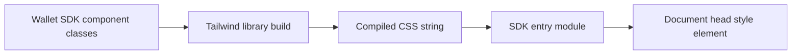

# SDK Automatic Styles

Feature Name: sdk-auto-styles
Updated: 2026-07-26

## Description

The Wallet SDK compiles its component Tailwind classes during the library build and embeds the resulting CSS string in the JavaScript entry module. Browser module evaluation injects a uniquely identified style element once.

## Architecture

## Components and Interfaces

- `src/wallet-sdk/styles.css` defines the Tailwind input and limits source scanning to SDK files.
- `src/wallet-sdk/index.ts` imports the compiled CSS as text and inserts one `style` element in browser environments.
- `vite.config.ts` enables the Tailwind Vite plugin for library builds and demo builds.

## Data Models

- Style element ID: `jacobscod-wallet-sdk-styles`.
- CSS payload: a build-time string exported from `styles.css?inline`.

## Correctness Properties

- The document contains at most one element with the SDK style element ID.
- Server-side evaluation performs no document access.
- The published ESM, CJS, and UMD entries include the CSS payload.

## Error Handling

- The style injection path exits when the browser document is unavailable.
- Existing style elements are retained to support repeated imports and hot reload.

## Test Strategy

- Type-check the project.
- Build the library with Node.js 24.
- Inspect each generated JavaScript entry for the style element ID and a representative utility class.
- Inspect the npm package file list before publication.

## References

[^1]: [Vite library mode CSS support](https://vite.dev/guide/build.html)
